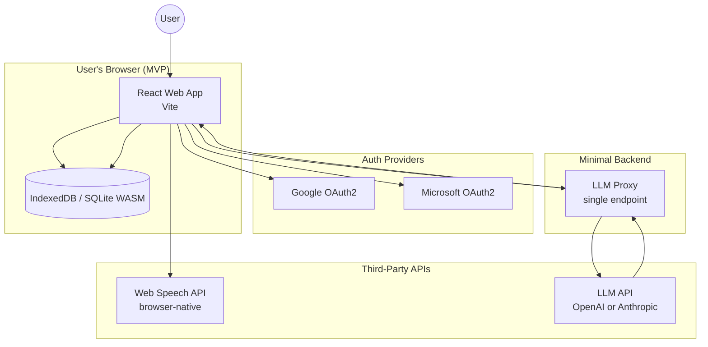

# Architecture

---

## System Overview

A local-first, cross-platform workout tracker. User data lives on their device. Authentication uses the user's existing Google or Microsoft account via OAuth2 — identity only, not storage. The one server-side component is a minimal LLM proxy — a single endpoint that holds the LLM API key server-side so it is never exposed in client code.

---

## Components

### Web App — React (Vite) [MVP]
- TypeScript throughout
- IndexedDB or SQLite WASM for local storage in-browser
- OAuth2 via Google and Microsoft (Apple Sign-In is Apple-device-only; not available on web)
- Voice input via browser Web Speech API
- Handles all input modalities for MVP: voice dictation, text notes, conversation

### Mobile App — Expo (React Native) [V1+]
- iOS and Android from a single codebase
- Shares TypeScript types and business logic with the web app
- `expo-sqlite` for local data storage
- `expo-auth-session` for OAuth2 flows (adds Apple Sign-In here — required by Apple)
- Native Speech APIs for voice input (more reliable than browser)

### Local Data Store
- Structured workout data only — no raw audio, no unprocessed voice recordings
- Audio is transcribed on-device (or via third-party STT), then discarded
- Only the parsed, structured result is persisted
- Schema defined in DATA_MODEL.md

### Input Pipeline
- **Voice**: Web Speech API → transcribed text → LLM proxy → structured result written to store
- **Text**: direct → LLM proxy → structured result written to store
- **Conversation**: back-and-forth via LLM proxy → structured result written to store
- Raw audio is never stored. Transcriptions are processed and discarded.
- See SECURITY_PRIVACY.md for third-party disclosure obligations

### LLM Proxy [minimal backend]
- A single server-side endpoint that forwards parsing requests to the LLM API
- Holds the LLM API key — never exposed in client-side code
- Stateless: receives workout note text, returns structured JSON, stores nothing
- No user data is logged or persisted server-side
- Implemented as a lightweight serverless function (e.g. Vercel Edge Function, Cloudflare Worker) to minimize infrastructure footprint
- Structured behind a swappable interface to support on-device LLM in V1+

### Authentication
- Google OAuth2 — all platforms
- Apple Sign-In — iOS and macOS only (Apple restriction)
- Microsoft OAuth2 — all platforms
- Provides identity only for MVP. No cloud storage is accessed.
- Tokens stored securely in device keychain / secure storage

---

## Key Decisions

### Local-first, minimal backend (MVP)
User data lives on-device. The only server-side component is a stateless LLM proxy — one endpoint, no database, no user data stored. This keeps infrastructure footprint minimal, limits our data liability, and aligns with the privacy stance in PRODUCT_OVERVIEW.md.

The proxy is necessary because LLM API keys cannot be safely embedded in client-side code — they would be visible to anyone inspecting the browser bundle. A serverless function (Vercel Edge Function or Cloudflare Worker) is the lightest viable option: no server to maintain, scales to zero when unused.

**Cloud sync is explicitly deferred to V1+.** When revisited, the preferred approach is user-owned storage (Google Drive, iCloud, OneDrive) rather than a proprietary database.

### Web-first, Expo mobile in V1+
The primary developer has React experience but not React Native experience. Starting with a React (Vite) web app proves the core input parsing and logging loop in a familiar environment. Expo mobile is added in V1+ once the product is validated and the developer is ready to take on React Native specifics. Business logic and TypeScript types will be structured for extraction into a shared package at that point.

### Two OAuth2 providers for MVP web, three for mobile
Google and Microsoft OAuth2 are supported in the MVP web app. Apple Sign-In is not available on web (Apple restriction) and is deferred to V1+ when the Expo mobile app is built — at which point it becomes mandatory (Apple requires it for any iOS app offering other social logins).

### Email input deferred to V1+
Email ingestion requires server-side infrastructure (an email receiver + routing logic). Deferring keeps MVP at zero backend. Will be revisited after core voice/text input is proven.

---

## What This Architecture Does Not Include (MVP)

- No proprietary data store or API server (one stateless LLM proxy only)
- No cloud database
- No mobile app (web only)
- No Apple Sign-In
- No push notifications
- No email ingestion
- No cross-device sync
- No data analytics or telemetry

---

## V1+ Considerations

- **Expo mobile app**: iOS and Android, shares logic with web app
- **Apple Sign-In**: required once mobile app ships
- **Cloud sync**: user-owned storage via Google Drive / iCloud / OneDrive APIs
- **Email input**: inbound routing service (e.g. Pipedream) + OAuth inbox reading, or .NET Minimal API webhook receiver
- **On-device LLM**: eliminates cloud LLM trust boundary entirely; proxy interface already structured for this swap
- **Shared logic package**: extract shared TypeScript types and business logic into a workspace package consumed by both Expo and web apps
