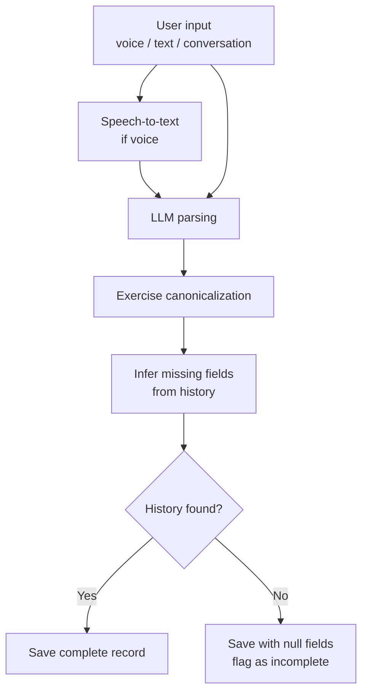
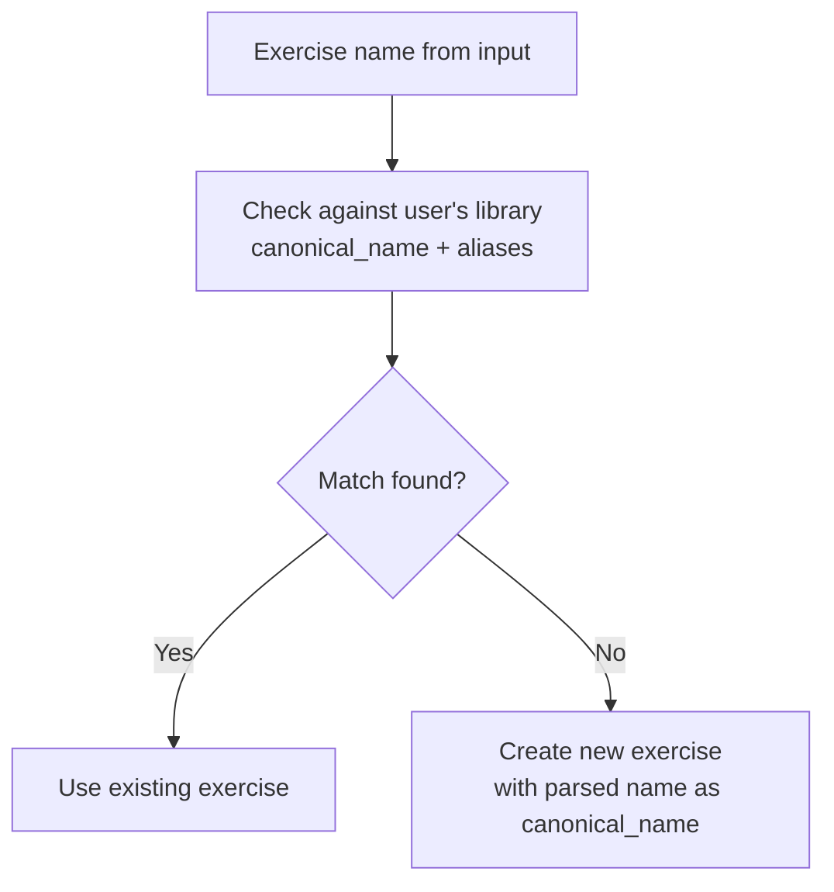

# Business Logic

Defines the rules and behaviors that turn raw user input into structured data, track progression, and generate the weekly digest.

---

## 1. Input Parsing

### Flow

### Rules

**What the LLM extracts from input:**
- Session date (inferred from language: "yesterday", "this morning", "last Tuesday" — defaults to today if absent)
- Session type (inferred from exercises mentioned or explicit statement: "push day", "leg day")
- Health state (inferred from language: "felt tired", "shoulder was tight")
- Exercise names (matched against personal library — see canonicalization below)
- Per-set data: weight, reps, set count

**Handling missing fields — infer from history first:**
1. Look up the user's most recent logged set for the same exercise
2. Use those values as defaults for any missing fields
3. Flag the record to indicate values were inferred, not stated
4. If no history exists, save the record with null fields and flag as incomplete

**Incomplete records** are surfaced in the UI so the user can fill them in. They are excluded from progression calculations until completed.

**Conversational input:** for short back-and-forth sessions, the LLM accumulates context across turns before writing to the store. The final structured result is written once, not incrementally.

**"Same as last time"** and similar references: the LLM resolves these by reading the user's most recent session for the relevant exercise before parsing.

---

## 2. Exercise Canonicalization

When the LLM encounters an exercise name in input:

**Matching:** case-insensitive. The LLM also performs semantic matching — "flat bench" and "barbell bench press" should match "Bench Press" if either exists as a canonical name or alias. When semantic confidence is low, a new exercise is created rather than a potentially wrong match.

**User-controlled merging:** the user can merge two exercises (e.g. "flat bench" and "bench press" if they ended up as separate entries). Merging moves all sets from the source exercise to the target, adds the source's canonical name as an alias on the target, and deletes the source.

---

## 3. Workout Plan Creation

A Plan contains one or more named Workouts (e.g. Push Day, Pull Day). Each Workout contains its own PlanExercises with independent PO targets. All three input tiers translate to the same `PlanExercise` fields in the data model.

### Tier 1 — Narrative
User provides a goal in natural language: "I want to get to a 225lb bench press."

LLM steps:
1. Read the user's exercise history to find current baseline (most recent sets for that exercise)
2. Estimate a realistic increment rate based on the gap between current and goal
3. Infer a reasonable `increment_frequency` (default: per session)
4. Populate `PlanExercise` fields accordingly
5. Show the user the translated plan before saving — always confirm before writing

### Tier 2 — Rule-based
User states an explicit rule: "+5lbs per session on bench press."

Maps directly to:
- `increment_type`: `"weight"`
- `increment_value`: `5`
- `increment_unit`: `"lbs"`
- `increment_frequency`: `"per_session"`

Starting values pulled from most recent session history.

### Tier 3 — Manual
User specifies every field directly. No LLM inference. Used by power users who want full control.

### Advancing targets

After a session is logged for a Workout:
- For each PlanExercise in that Workout: if `increment_frequency` is `per_session`, advance `current_target_index` immediately
- If `increment_frequency` is `per_week`: advance only if the last advancement was more than 7 days ago
- PO targets advance independently per Workout — logging Push Day does not advance targets for the same exercise in Full Body

Target advancement is not retroactive. If a session is logged late (past date), targets advance from the time of logging, not the session date.

---

## 4. Progression Calculation

Used by the weekly digest and available on-demand per exercise.

### Actual rate of progression

For a given exercise, over a given time window:
- Collect all sets for that exercise, ordered by `session.date`
- Calculate the slope of weight (or reps, or volume) over time
- Express as: average change per session, and average change per week

**Volume** = sets × reps × weight (normalized to lbs for calculation)

### Comparison to plan rate

If the user has an active plan with a `PlanExercise` for this exercise:
- Calculate the intended rate from `increment_value` + `increment_frequency`
- Express as: intended change per week
- Compare: actual rate vs. intended rate
- Report as a ratio (e.g. "tracking at 80% of planned rate") — not as pass/fail

### Drift detection

**Drift** is the condition where the current plan is not working for the user. It is not a single failure — it is a pattern. Any of the following signals drift:

- No sessions logged in the past 14 days (absence)
- Sessions logged but consistently falling short of plan targets (underperformance)
- Sessions logged, targets nominally met, but actual weight/reps/volume not increasing (plateau)
- Recurring negative health state notes across recent sessions (e.g. "fatigued", "shoulder tight", "too sore") suggesting the plan may be too aggressive

Drift is assessed per-exercise (for plan exercises) and at the session level (for overall logging patterns).

**Session-level drift:** no sessions of any type logged in the past 14 days.
- Digest message: notes absence, does not assume reason

**Exercise-level drift:** any of the following across the last 4 logged sessions for a plan exercise:
- Less than 50% of the intended increment rate achieved
- Targets consistently not met (logged weight/reps below `current_target_*`)
- No measurable progression in weight, reps, or volume
- Two or more sessions with health state notes referencing the same body part or fatigue

**LLM-generated suggestions when drift is detected:**
- Read the exercise history (recent sets) and the plan's increment rule
- Read health_state notes from recent sessions for context
- Suggest one of: reduce weight and rebuild, switch increment focus (weight → reps), adjust frequency, deload week, modify the plan target
- Suggestions are advisory — never auto-modify the plan

---

## 5. Weekly Digest

Generated on a rolling 7-day cadence. Covers the prior 7 days.

### Contents

**1. This week's summary**
- Sessions logged: count, types, dates
- Total sets logged
- If no sessions: note the absence without judgment

**2. Progression snapshot**
- For each exercise in the active plan: actual rate vs. planned rate this week
- For exercises not in a plan: simple trend (up / flat / down) based on last 3 sessions

**3. PRs and milestones**
- New weight PR for any exercise (highest single-set weight ever logged)
- New volume PR for any exercise (highest single-session volume ever)
- First time hitting a target set in the plan

**4. Drift alerts and suggestions**
- Session-level drift: if triggered, note the absence and suggest resuming
- Exercise-level drift: if triggered, include LLM-generated suggestion for that exercise
- Only shown if drift is detected — omitted from digest if nothing to report

**5. Plan adherence summary**
- One-line summary: "You're tracking at roughly X% of your planned progression rate this week"
- Not shown if no active plan

### Digest tone

The digest reports what happened — it does not moralize. A week with no sessions is reported factually. Plateaus are described with suggestions, not shame. PRs are called out positively. The LLM generating the digest text should match the user's own language from their session notes where possible.

---

## 6. Local Storage Eviction

To prevent local storage from growing indefinitely on mobile browsers, session history is capped at a rolling 3-month window.

### Rules

- On app load and after each session save, delete any SESSION records (and their associated SET records) where `session.date` is older than 90 days from today
- Eviction is silent — no user notification
- Only SESSION and SET records are evicted. PLAN, WORKOUT, PLAN_EXERCISE, PLAN_TARGET, EXERCISE, and DIGEST_REPORT are never evicted — the user's plan and exercise library are always preserved
- DIGEST_REPORT records older than 90 days are also evicted (they reference the same historical window)

### V1+ — 3-Month Progress Email

When a user's account reaches 3 months of history (or at each 3-month anniversary), generate and send a visual progression summary by email. This requires email storage (user's email address) and an email-sending service — both deferred to V1+. See ARCHITECTURE.md for the infrastructure implications.

---

## 7. Out of Scope (MVP)

- No push notifications — digest is generated on demand or on a scheduled pull
- No social features, sharing, or comparison to other users
- No AI-generated workout plans from scratch — plans are user-initiated
- No auto-modification of plans — all suggestions require user confirmation
