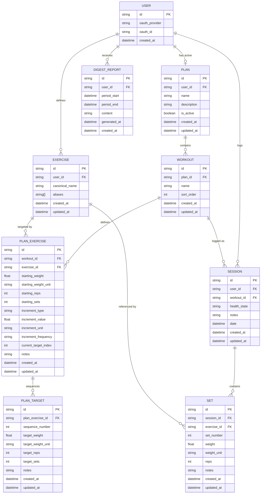

# Data Model

All data is stored locally on the user's device. No data is sent to a proprietary backend. See ARCHITECTURE.md for storage technology per platform.

---

## Entity Overview

---

## Entities

### User

Represents an authenticated identity. Stores only what's needed to identify the user across sessions — no health data, no personal information beyond OAuth identity.

| Field | Type | Notes |
|-------|------|-------|
| id | string (UUID) | Primary key |
| oauth_provider | string | `"google"` or `"microsoft"` |
| oauth_id | string | Subject ID from the OAuth provider |
| created_at | datetime | |

No email address, display name, or profile data is stored. All are fetched from the OAuth token at session time when needed (e.g. for V1+ summary emails) and never persisted.

---

### Exercise

The user's personal exercise library. Built incrementally as the user logs workouts — no pre-seeded list.

| Field | Type | Notes |
|-------|------|-------|
| id | string (UUID) | Primary key |
| user_id | string (UUID FK) | Owner |
| canonical_name | string | User's preferred name, e.g. "Bench Press" |
| aliases | string[] | Other names that map to this exercise, e.g. `["flat bench", "barbell bench"]` |
| created_at | datetime | |
| updated_at | datetime | |

**Canonicalization:** When the LLM parses input and encounters an exercise name, it checks the user's library for a match against `canonical_name` and `aliases`. If a match is found, the existing exercise is used. If not, a new exercise is created with the parsed name as `canonical_name`.

---

## Plans and Workouts

A Plan is the user's overall training program. It contains one or more named Workouts — each representing a distinct training day or type (e.g. Push Day, Pull Day, Full Body). The user picks which Workout to do on a given day.

### Plan

| Field | Type | Notes |
|-------|------|-------|
| id | string (UUID) | Primary key |
| user_id | string (UUID FK) | Owner |
| name | string | e.g. "Summer Strength Block" |
| description | string | Narrative goal — source material for LLM translation |
| is_active | boolean | Only one plan active at a time |
| created_at | datetime | |
| updated_at | datetime | |

### Workout

A named training day within a plan. Groups exercises that are performed together.

| Field | Type | Notes |
|-------|------|-------|
| id | string (UUID) | Primary key |
| plan_id | string (UUID FK) | Parent plan |
| name | string | e.g. "Push Day", "Leg Day", "Full Body" |
| sort_order | int | Display order within the plan |
| created_at | datetime | |
| updated_at | datetime | |

### PlanExercise

An exercise within a specific Workout, with its progressive overload configuration. PO targets advance independently per Workout — the same exercise appearing in two Workouts has separate targets in each.

| Field | Type | Notes |
|-------|------|-------|
| id | string (UUID) | Primary key |
| workout_id | string (UUID FK) | Parent workout |
| exercise_id | string (UUID FK) | Exercise from the user's library |
| starting_weight | float | Baseline weight when plan began |
| starting_weight_unit | string | `"lbs"` or `"kg"` |
| starting_reps | int | Baseline reps |
| starting_sets | int | Baseline sets |
| increment_type | string | Optional. What progresses: `"weight"`, `"reps"`, `"sets"`, `"volume"` |
| increment_value | float | Optional. How much to increment per step (e.g. `5`) |
| increment_unit | string | Optional. `"lbs"`, `"kg"`, `"reps"`, `"sets"` |
| increment_frequency | string | Optional. `"per_session"`, `"per_week"` |
| current_target_index | int | Index into the PlanTarget sequence — advances after each logged session |
| notes | string | LLM-translated narrative or manual notes |
| created_at | datetime | |
| updated_at | datetime | |

### PlanTarget

An ordered step in the progression sequence for a PlanExercise.

| Field | Type | Notes |
|-------|------|-------|
| id | string (UUID) | Primary key |
| plan_exercise_id | string (UUID FK) | Parent plan exercise |
| sequence_number | int | Position in the sequence (1, 2, 3…) — not a date |
| target_weight | float | Target weight for this step |
| target_weight_unit | string | `"lbs"` or `"kg"` |
| target_reps | int | Target reps for this step |
| target_sets | int | Target sets for this step |
| notes | string | Optional note for this step, e.g. "deload week" |
| created_at | datetime | |
| updated_at | datetime | |

---

## Logged History

### Session

A logged instance of completing a Workout. Records when it happened and any contextual notes.

| Field | Type | Notes |
|-------|------|-------|
| id | string (UUID) | Primary key |
| user_id | string (UUID FK) | Owner |
| workout_id | string (UUID FK) | Which workout was performed |
| health_state | string | Free-form, e.g. "fatigued", "feeling strong" — LLM infers from input |
| notes | string | Raw or summarized input, and any post-workout journal notes |
| date | datetime | When the workout happened (not when it was logged — may differ) |
| created_at | datetime | When the record was created |
| updated_at | datetime | |

**On `date` vs `created_at`:** A user may log a workout days after it happened. `date` is the actual workout date, inferred from input if possible, defaulting to `created_at` if unknown.

### Set

A single set of an exercise within a session. The atomic unit of workout data.

| Field | Type | Notes |
|-------|------|-------|
| id | string (UUID) | Primary key |
| session_id | string (UUID FK) | Parent session |
| exercise_id | string (UUID FK) | Exercise from the user's library |
| set_number | int | Order within this exercise in this session (1, 2, 3…) |
| weight | float | Numeric value — stored as entered, not normalized |
| weight_unit | string | `"lbs"` or `"kg"` |
| reps | int | |
| notes | string | Optional per-set note |
| created_at | datetime | |
| updated_at | datetime | |

**On weight units:** Weight is stored as entered alongside its unit. Conversion to the user's display preference happens at query time.

---

### DigestReport

A saved weekly in-app summary. Stored so the user can refer back to historical reports.

| Field | Type | Notes |
|-------|------|-------|
| id | string (UUID) | Primary key |
| user_id | string (UUID FK) | Owner |
| period_start | datetime | Start of the reporting window |
| period_end | datetime | End of the reporting window (typically 7 days after start) |
| content | string | The full generated report — stored as Markdown |
| generated_at | datetime | When the report was generated |
| created_at | datetime | |

---

## Key Design Decisions

### Plan → Workout → Exercise hierarchy
A Plan contains named Workouts (Push Day, Pull Day, etc.). Each Workout contains its own set of PlanExercises. The user picks which Workout to perform on a given day. See ADR: `decisions/2026-04-17-workout-layer-independent-po.md`.

### PO targets advance independently per Workout
If the same exercise appears in two Workouts, it has a separate PlanExercise — and therefore separate PO targets — in each. Logging "Push Day" advances only Push Day's bench press target, not Full Body's. This avoids ambiguity about which target to advance when the same exercise appears in multiple contexts. See ADR: `decisions/2026-04-17-workout-layer-independent-po.md`.

### Free-form health_state and notes on Session
Both fields are free text. The LLM infers and populates `health_state` from natural input. `notes` stores both the raw/summarized input and any post-workout journal thoughts the user adds.

### Exercise library is user-owned and grows on the fly
There is no global exercise database. The user's library starts empty and is built as they log. This keeps the model simple and ensures naming always reflects the user's own vocabulary.

### Sets as the atomic record
Each set is its own record rather than summarizing "3 sets of 8 at 185" as a single row. This enables per-set progression tracking over time.

### One active plan at a time, no end date
`is_active` is a boolean on the plan — only one can be true at a time. Switching plans deactivates the current one (archived, not deleted).

### No raw audio stored
Voice input is transcribed on-device (or via third-party STT), then the transcription is parsed. Neither the audio file nor the raw transcription is persisted — only the structured result.
