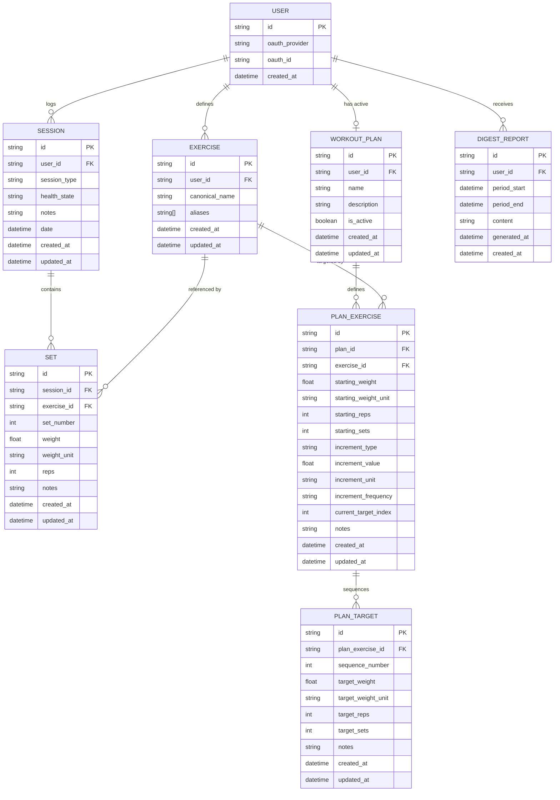

# Data Model

All data is stored locally on the user's device. No data is sent to a proprietary backend. See ARCHITECTURE.md for storage technology per platform.

---

## Entity Overview

---

## Entities

### User

Represents an authenticated identity. Stores only what's needed to identify the user across sessions — no health data, no personal information beyond OAuth identity.

| Field | Type | Notes |
|-------|------|-------|
| id | string (UUID) | Primary key |
| oauth_provider | string | `"google"` or `"microsoft"` |
| oauth_id | string | Subject ID from the OAuth provider |
| created_at | datetime | |

No email address, display name, or profile data is stored. If display name is needed for UI, it is fetched from the OAuth token at session time and never persisted.

---

### Exercise

The user's personal exercise library. Built incrementally as the user logs workouts — no pre-seeded list.

| Field | Type | Notes |
|-------|------|-------|
| id | string (UUID) | Primary key |
| user_id | string (UUID FK) | Owner |
| canonical_name | string | User's preferred name, e.g. "Bench Press" |
| aliases | string[] | Other names that map to this exercise, e.g. `["flat bench", "barbell bench"]` |
| created_at | datetime | |
| updated_at | datetime | |

**Canonicalization:** When the LLM parses input and encounters an exercise name, it checks the user's library for a match against `canonical_name` and `aliases`. If a match is found, the existing exercise is used. If not, a new exercise is created with the parsed name as `canonical_name`. The user can later rename the canonical name or merge two exercises (which moves all sets from one to the other and adds the old name as an alias).

---

### Session

A single workout session. Contains free-form context about the session alongside the structured set data.

| Field | Type | Notes |
|-------|------|-------|
| id | string (UUID) | Primary key |
| user_id | string (UUID FK) | Owner |
| session_type | string | Free-form, e.g. "upper body", "push day", "cardio" — LLM infers from input if not stated |
| health_state | string | Free-form, e.g. "fatigued", "injured left shoulder", "feeling strong" |
| notes | string | Raw or summarized input that generated this session — kept for reference |
| date | datetime | When the workout happened (not when it was logged — may differ) |
| created_at | datetime | When the record was created |
| updated_at | datetime | |

**On `date` vs `created_at`:** A user may log a workout days after it happened (e.g. from a saved voice note). `date` is the actual workout date, inferred from input if possible, defaulting to `created_at` if unknown.

---

### Set

A single set of an exercise within a session. This is the atomic unit of workout data.

| Field | Type | Notes |
|-------|------|-------|
| id | string (UUID) | Primary key |
| session_id | string (UUID FK) | Parent session |
| exercise_id | string (UUID FK) | Exercise from the user's library |
| set_number | int | Order within this exercise in this session (1, 2, 3…) |
| weight | float | Numeric value — stored as entered, not normalized |
| weight_unit | string | `"lbs"` or `"kg"` |
| reps | int | |
| notes | string | Optional per-set note, e.g. "form broke down on last rep" |
| created_at | datetime | |
| updated_at | datetime | |

**On weight units:** Weight is stored as entered alongside its unit. Conversion to the user's display preference happens at query time. This avoids floating-point conversion errors in stored data.

---

## Workout Plans

A plan defines the intended progression trajectory for exercises over time. Only one plan can be active at a time. Plans have no end date — they are open-ended.

### WorkoutPlan

| Field | Type | Notes |
|-------|------|-------|
| id | string (UUID) | Primary key |
| user_id | string (UUID FK) | Owner |
| name | string | e.g. "Summer strength block" |
| description | string | Narrative goal — source material for LLM translation |
| is_active | boolean | Only one plan active at a time |
| created_at | datetime | |
| updated_at | datetime | |

### PlanExercise

The per-exercise configuration within a plan. Stores the starting point, an optional increment rule (used to auto-generate targets), and a pointer to the current position in the target sequence.

| Field | Type | Notes |
|-------|------|-------|
| id | string (UUID) | Primary key |
| plan_id | string (UUID FK) | Parent plan |
| exercise_id | string (UUID FK) | Exercise from the user's library |
| starting_weight | float | Baseline weight when plan began |
| starting_weight_unit | string | `"lbs"` or `"kg"` |
| starting_reps | int | Baseline reps |
| starting_sets | int | Baseline sets |
| increment_type | string | Optional. What progresses: `"weight"`, `"reps"`, `"sets"`, `"volume"` |
| increment_value | float | Optional. How much to increment per step (e.g. `5`) |
| increment_unit | string | Optional. `"lbs"`, `"kg"`, `"reps"`, `"sets"` |
| increment_frequency | string | Optional. `"per_session"`, `"per_week"` |
| current_target_index | int | Index into the `PlanTarget` sequence — advances after each logged session |
| notes | string | LLM-translated narrative or manual notes |
| created_at | datetime | |
| updated_at | datetime | |

### PlanTarget

An ordered step in the progression sequence for a plan exercise. All three input tiers produce rows in this table — the difference is how they're generated.

| Field | Type | Notes |
|-------|------|-------|
| id | string (UUID) | Primary key |
| plan_exercise_id | string (UUID FK) | Parent plan exercise |
| sequence_number | int | Position in the sequence (1, 2, 3…) — not a date |
| target_weight | float | Target weight for this step |
| target_weight_unit | string | `"lbs"` or `"kg"` |
| target_reps | int | Target reps for this step |
| target_sets | int | Target sets for this step |
| notes | string | Optional note for this step, e.g. "deload week" |
| created_at | datetime | |
| updated_at | datetime | |

**Three input tiers — all produce `PlanTarget` rows:**
- **Narrative**: "I want to get to 225lbs bench" → LLM infers starting point from history, generates a sequence of `PlanTarget` rows representing the trajectory
- **Rule-based**: "+5lbs per session" → auto-generates uniform `PlanTarget` rows from the increment fields; more rows generated on a rolling basis as needed
- **Manual**: user creates each `PlanTarget` row directly — any pattern, any values

**Current target** is always `PlanTarget` where `sequence_number = current_target_index`. After a session is logged, `current_target_index` advances by 1.

**Progression reporting:** uses `session.date` and `set` history to plot actual progression curve against the `PlanTarget` sequence. Does not check specific date adherence — compares relative rate of improvement.

### DigestReport

A saved weekly digest. Stored so the user can refer back to historical reports.

| Field | Type | Notes |
|-------|------|-------|
| id | string (UUID) | Primary key |
| user_id | string (UUID FK) | Owner |
| period_start | datetime | Start of the reporting window |
| period_end | datetime | End of the reporting window (typically 7 days after start) |
| content | string | The full generated report — stored as Markdown |
| generated_at | datetime | When the report was generated (may differ from period_end) |
| created_at | datetime | |

Reports are generated on demand or on a rolling weekly cadence. Multiple reports may exist for overlapping periods (e.g. user generates mid-week, then again at end of week). All are kept — never overwritten.

---

## Key Design Decisions

### Free-form session_type and health_state
Both fields are free text rather than enums. The LLM infers and populates them from natural input. This avoids constraining the user to a fixed vocabulary and allows the data to reflect how they actually describe their workouts.

### Exercise library is user-owned and grows on the fly
There is no global exercise database. The user's library starts empty and is built as they log. This keeps the model simple, avoids licensing or maintenance of a third-party exercise dataset, and ensures the naming always reflects the user's own vocabulary.

### Sets as the atomic record
Each set is its own record rather than summarizing "3 sets of 8 at 185" as a single row. This enables per-set progression tracking over time (e.g. noticing that the third set used to fail at 6 reps and now consistently hits 8).

### One active plan at a time, no end date
Plans are open-ended. `is_active` is a boolean on the plan — only one can be true at a time. Switching plans deactivates the current one (archived, not deleted).

### Progression targets advance on session log
After a session is logged that includes a plan exercise, `current_target_index` on the relevant `PlanExercise` advances by 1, pointing to the next `PlanTarget` row. For rule-based plans, new `PlanTarget` rows are generated ahead of time on a rolling basis so the next target always exists.

### No date-based adherence tracking
Reporting compares actual rate of progression (derived from `session.date` + `set` history) against the intended rate (from `PlanExercise` increment rules). It does not flag missed sessions or track whether specific targets were hit on specific dates.

### No raw audio stored
Voice input is transcribed on-device (or via third-party STT), then the transcription is parsed. Neither the audio file nor the raw transcription is persisted — only the structured result. See SECURITY_PRIVACY.md.
