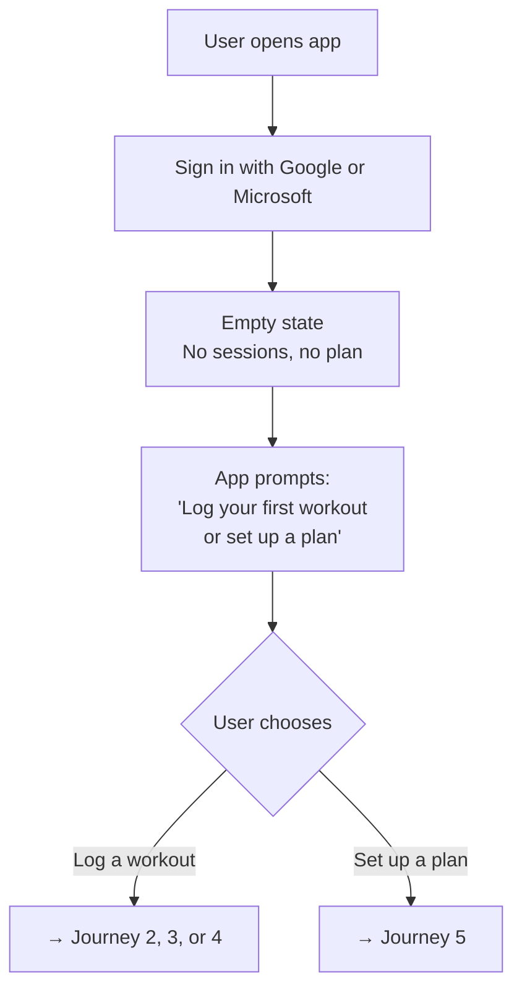
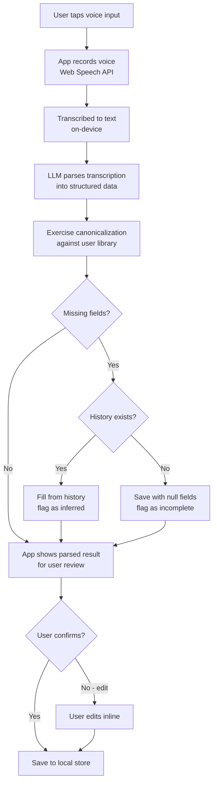
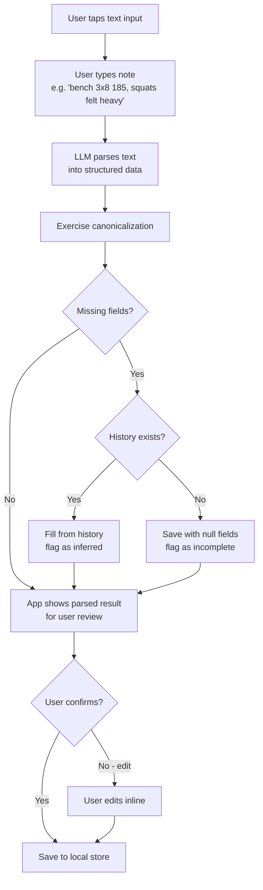
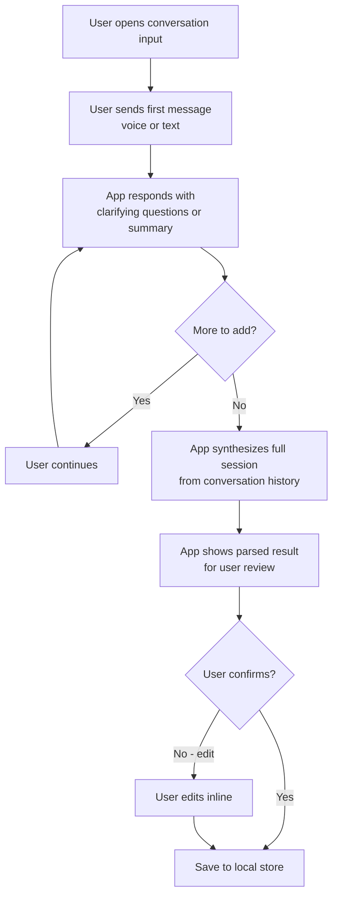
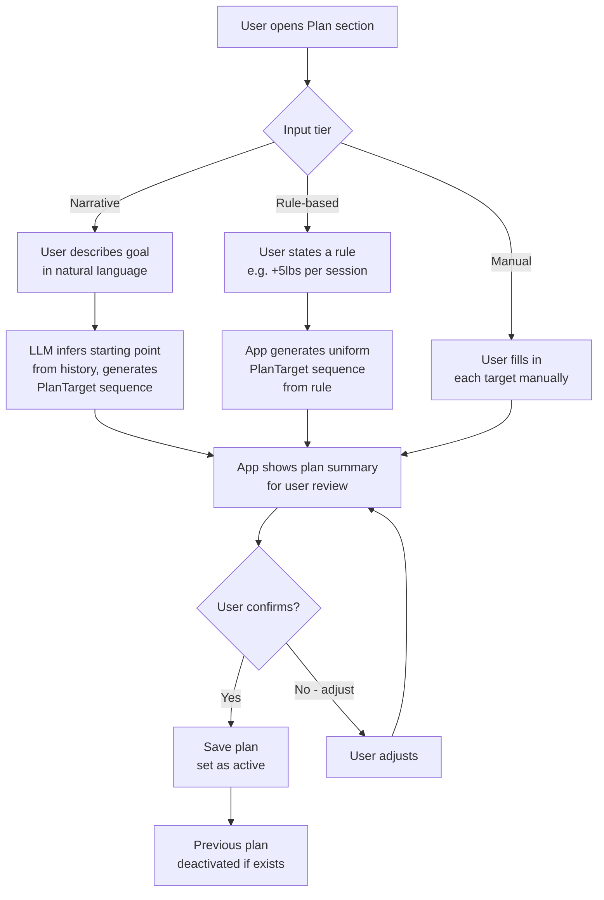
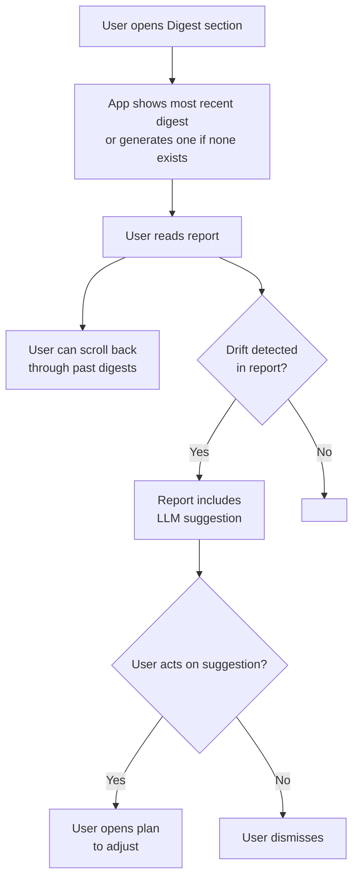
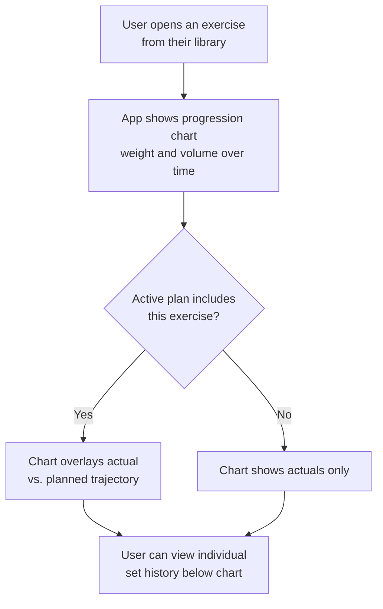
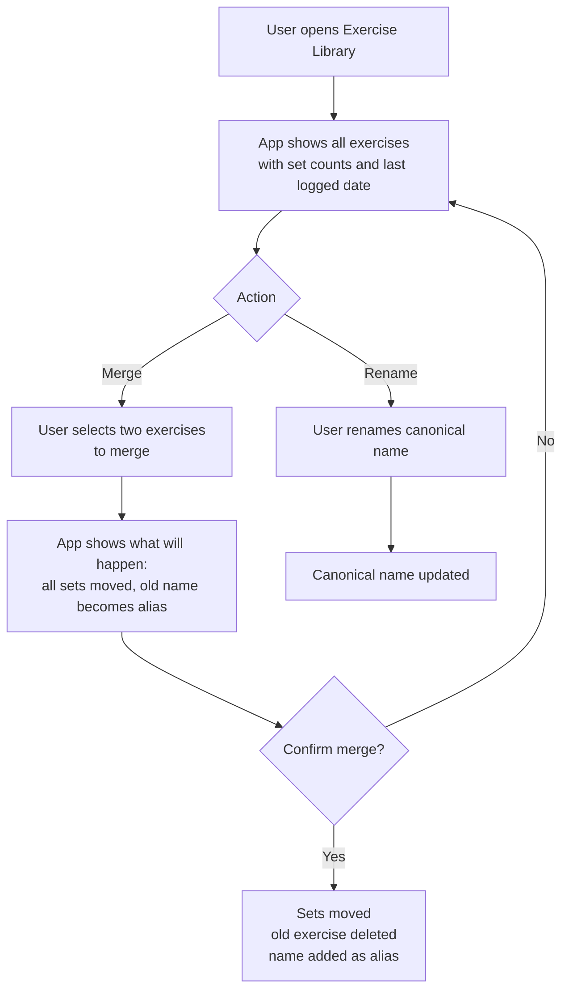

# User Journeys

Maps how a user moves through the product for each core flow. Focuses on experience, not implementation. See BUSINESS_LOGIC.md for parsing and progression rules.

---

## 1. Onboarding

First time the user opens the app.

**Notes:**
- No profile setup required — display name pulled from OAuth token, never stored
- No onboarding wizard or tutorial — the app explains itself through the empty state prompt
- User can skip both and just explore

---

## 2. Log a Workout — Voice

The primary input flow.

**Notes:**
- Audio is never saved — discarded after transcription
- The parsed preview shows exactly what will be stored before the user confirms
- Inferred fields are visually distinguished from stated fields so the user knows what the app guessed
- Incomplete records (null fields) can be filled in later from the session view

---

## 3. Log a Workout — Text Note

For users who prefer typing or are in a quiet environment.

**Notes:**
- Same parsing pipeline as voice — only the input method differs
- Supports casual natural language: "same as last time but added 5lbs", "did my usual push day, felt tired"
- The original text note is saved in `session.notes` for reference

---

## 4. Log a Workout — Conversation

For when the user wants to talk through a session or has a voice memo from days ago.

**Notes:**
- The LLM accumulates context across the full conversation before writing to the store — nothing is saved mid-conversation
- Supports past-dated sessions: "this was from Tuesday" → `session.date` set accordingly
- Useful for processing saved voice memos: user pastes or dictates a note from days ago and the app synthesizes it

---

## 5. Create a Workout Plan

**Notes:**
- LLM always shows the translated plan before saving — user confirms before anything is written
- Previous active plan is deactivated (not deleted) when a new one is saved
- Manual tier allows any progression pattern, including non-uniform sequences (deload weeks, periodization blocks)

---

## 6. View Weekly Digest

**Notes:**
- Digest is generated on demand — user pulls it when they want it, not pushed automatically (MVP)
- Past digests are stored and accessible in reverse chronological order
- Drift suggestions are advisory — tapping one opens the plan editor, nothing changes automatically

---

## 7. Review Exercise Progression

**Notes:**
- Primary view is the progression chart — weight or volume over time, user can toggle
- If the exercise is in the active plan, the planned trajectory is shown as a reference line
- Individual set rows below the chart let the user see exact logged values

---

## 8. Manage Exercise Library

**Notes:**
- Library grows automatically as the user logs — no manual entry required
- Merge is the main maintenance action: consolidates duplicates that arose from variant naming
- Renaming only changes the canonical name — all aliases and set history are preserved
- Exercises cannot be deleted if they have associated sets (to preserve history)
